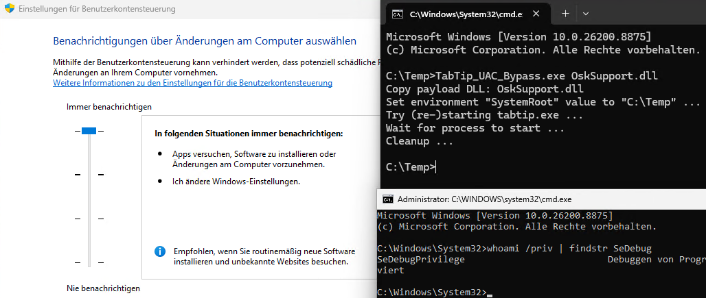

# TabTip UAC Bypass

This UAC bypass uses the TabTip.exe and forces DLL side-loading via SystemRoot environment variable. The program TabTip.exe searches for windows.storage.dll (newer ApplicationTargetedFeatureDatabase.dll, older rsaenh.dll) and loads this file in an UIAccess elevated context. After UIAccess permission and high integrity is achieved, a strategie like in my QuickAssist UAC bypass can be used. This bypass is always notify compatible and works for Windows client versions since Windows 8.1 and server versions since Windows Server 2016.

    Usage: UnifiedConsent_UAC_Bypass.exe [dll path]
    
    Example: UnifiedConsent_UAC_Bypass.exe OskSupport.dll

